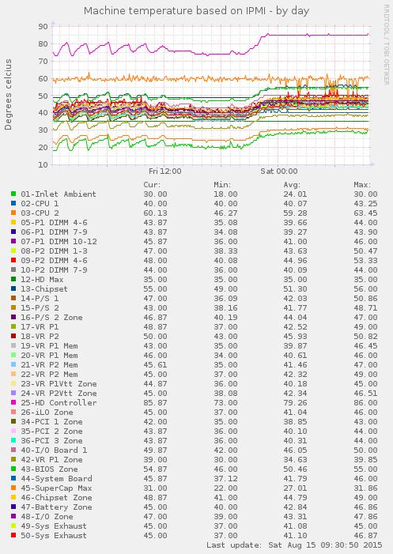
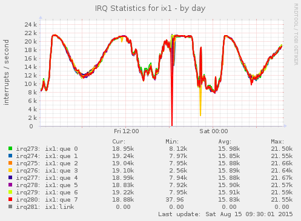
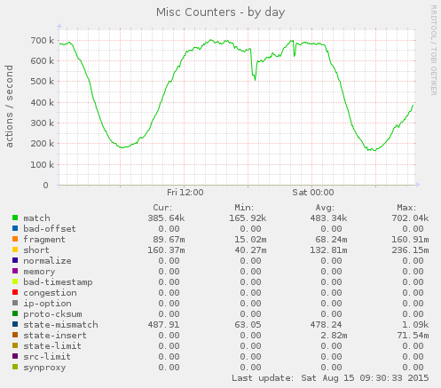

# freebsd-munin-plugins
[](https://github.com/farrokhi/freebsd-munin-plugins/issues)
[](https://github.com/farrokhi/freebsd-munin-plugins/blob/master/LICENSE)


A set of FreeBSD specific plugins for Munin

## Requirements
- All scripts are written in standard shell language, and `/bin/sh` would be sufficient.
- They are tailored and will run on FreeBSD.
- You need to install `lang/gawk` in order to run `intr_` plugin.
- You need to install `sysutils/ipmitool` in order to run `ipmi_` plugin.
- These are wildcard plugins, and should be installed using `munin-node-configure` program
- Some plugins such as `pf_`, `ipmi_` and `multiping_` need to have root access to run. To tell Munin to run a plugin as root, adapt the following snippet and add it to `/usr/local/etc/munin/plugin-conf.d/plugins.conf`:
```
[pf_*]
user root
```

## Setup
1. Make sure `sysutils/munin-node` is installed
2. Enable munin-node to run at startup: `sysrc munin_node_enable YES`
2. Clone this repo and copy all scripts to `/usr/local/share/munin/plugins`
3. run `munin-node-configure --suggest` and see if the plugins are detected.
4. run `munin-node-configure --shell | sh -x` to make appropriate symlinks
5. restart munin-node if running: `service munin-node restart`

## Plugins

- `intr_` graphs CPU timers, taken from `vmstat -i` output
- `cpu` graphs idle/system/user/nice/interrupt values for cpu (aggregated) - taken from `cpustat` program
- `if_` graphs interface traffic - taken from `ifcounters` program
- `if_packets_` graphs interface pps counters - taken from `ifcounters` program
- `netirq_` graphs per interface and per queue (in case of multi-queue) interrupt rates, taken from `vmstat -i` output
- `netisr_` graphs per-thread/per-protocol [`netisr(9)`](https://www.freebsd.org/cgi/man.cgi?format=html&query=netisr%289%29) statistics, taken from `netstat -Q`
- `netmem_` graphs [`mbuf(9)`](https://www.freebsd.org/cgi/man.cgi?format=html&query=mbuf%289%29) statistics, taken from `netstat -m`
- `pf_` graphs [`pf(4)`](https://www.freebsd.org/cgi/man.cgi?query=pf&sektion=4&apropos=0) firewall statistics, taken from `pfctl -vsi`
- `udp_` graphs UDP protocol traffic and error statistics, taken from `netstat -s -p udp`
- `ip_` graphs IP protocol traffic and error statistics, taken from `netstat -s -p ip`
- `ipmi_` graphs temperature, fan speed and power information from hardware chassis, taken from `ipmitool`
- `multiping_` graphs RTT and PacketLoss to multiple destinations from multiple source addresses on a given network interface

**Important Note**
Some of these plugins use `netstat` or `pfctl` output. Please beware that this might affect your system performance while under load or even lead to deadlock. The less you call them, the better.

### `ifcounters` helper program

In order to reduce number of calls to `netstat` to get interface counters (bytes, packets, errors, queue drops, etc), I created a small helper program that prints the counter values for given interface in munin friendly format. This also eliminate several calls to `awk` or `grep` in shell-script based munin plugins.

You can find it under a directory with the same name in this repository. You should build and install it in order to use `if_` and `if_packets_` plugins:
```
cd ifcounters
make install clean
```

### `cpustat` helper program

This helper program displays a simple average of `user`, `nice`, `system`, `interrupt` and `idle` values (measured in percent). It works as expected on UP and SMP machines so you won't need to do any fancy calculations to get a number. 
Please note that if you need accourate CPU usage information, you need to keep all the counters for each core separately. This helper program is created to give you an overall idea of your cpu resource usage on the whole.


## Sample Graphs



